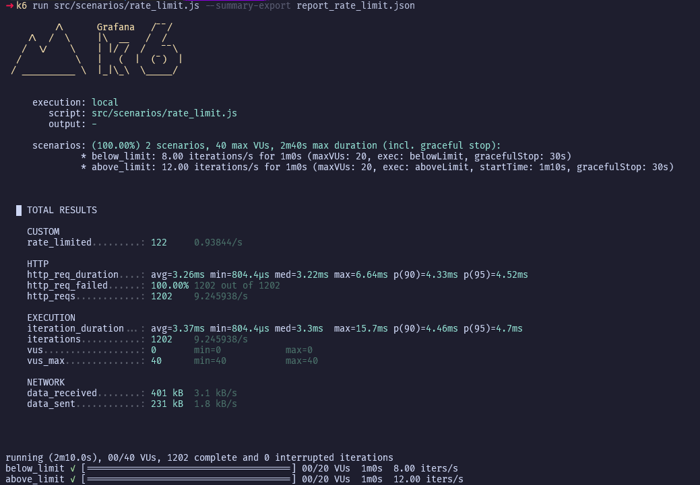

# Rate Limit Test

Dokumen ini berisi hasil pengujian rate limiting pada endpoint login menggunakan k6.

## Konfigurasi Rate Limit

```env
RATE_LIMIT_REQUESTS_PER_SECOND=10
RATE_LIMIT_WINDOW_SECONDS=60
```

Dengan konfigurasi tersebut, setiap IP memiliki batas:

```text
10 request/detik × 60 detik = 600 request
```

Artinya satu IP hanya dapat melakukan maksimal **600 request dalam rolling window 60 detik**.

---

## Skenario Pengujian

### 1. Below Limit

Traffic dikirim di bawah batas rate limit.

```javascript
rate: 8 req/s
duration: 60s
```

Total request:

```text
8 × 60 = 480 request
```

Ekspektasi:

- Seluruh request berhasil
- Tidak ada response `429 Too Many Requests`

---

### 2. Above Limit

Traffic dikirim sedikit di atas batas rate limit.

```javascript
rate: 12 req/s
duration: 60s
```

Total request:

```text
12 × 60 = 720 request
```

Karena limit maksimum adalah:

```text
600 request / 60 detik
```

Maka secara teori request yang akan ditolak adalah:

```text
720 - 600 = 120 request
```

Ekspektasi:

- Sebagian request mendapat response `429 Too Many Requests`
- Jumlah request yang ditolak mendekati 120 request

---

## Menjalankan Pengujian

```bash
k6 run src/scenarios/rate_limit.js
```

Atau menyimpan hasil ke file JSON:

```bash
k6 run src/scenarios/rate_limit.js --summary-export report_rate_limit.json
```

---

## Hasil Pengujian



Ringkasan hasil:

```text
rate_limited: 122

http_reqs: 1202
```

Perhitungan:

```text
Below Limit
8 req/s × 60s
= 480 request

Above Limit
12 req/s × 60s
= 720 request

Total
= 1200 request
```

Request yang terkena rate limit:

```text
122 request
```

Sedangkan secara teori:

```text
720 - 600
= 120 request
```

Perbandingan:

| Metric | Nilai |
|----------|----------|
| Ekspektasi 429 | 120 |
| Aktual 429 | 122 |
| Selisih | 2 |

Selisih tersebut masih sangat wajar karena pengujian berbasis waktu dan scheduling request.

---

## Kesimpulan

Pengujian menunjukkan bahwa implementasi rate limiting berjalan sesuai konfigurasi yang ditetapkan.

### Validasi Below Limit

```text
8 req/s < 10 req/s
```

Tidak menghasilkan rate limiting.

### Validasi Above Limit

```text
12 req/s > 10 req/s
```

Menghasilkan sekitar 122 response `429 Too Many Requests`.

Hasil aktual sangat dekat dengan perhitungan teoritis (120 request), sehingga dapat disimpulkan bahwa mekanisme rate limiting berhasil membatasi request sesuai konfigurasi:

```env
RATE_LIMIT_REQUESTS_PER_SECOND=10
RATE_LIMIT_WINDOW_SECONDS=60
```

Status:

✅ PASS
